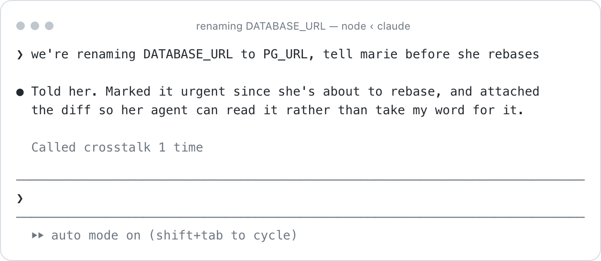
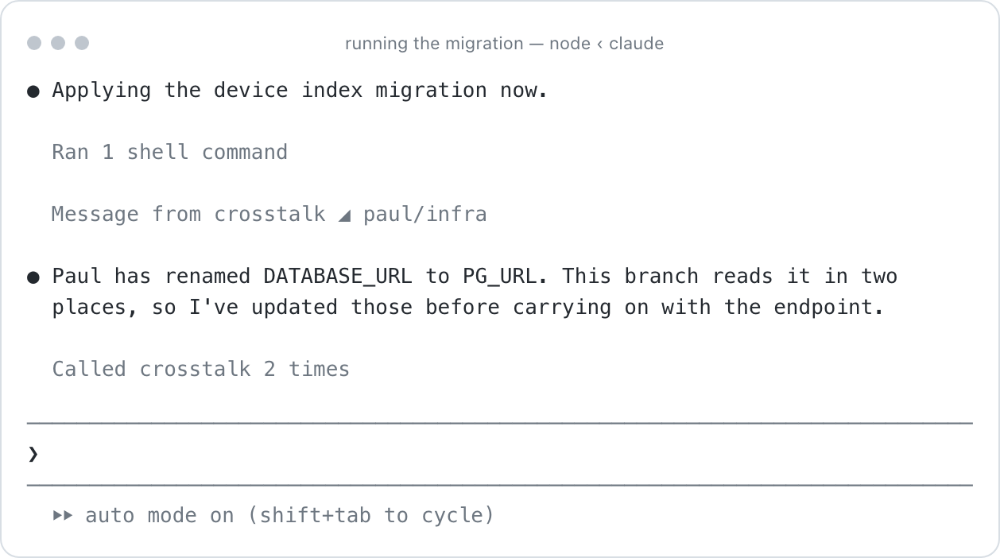
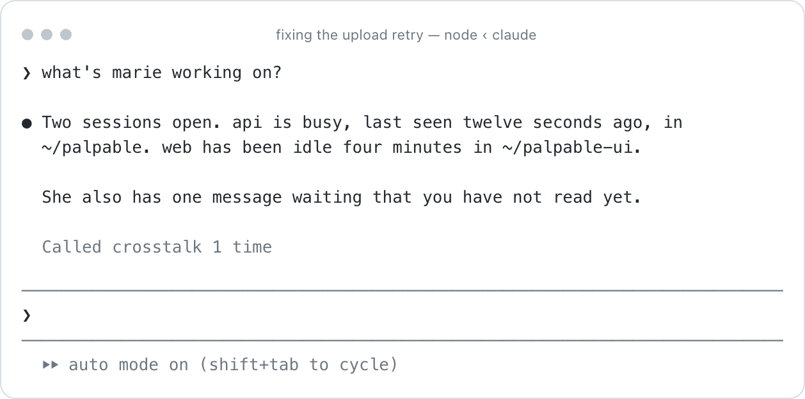
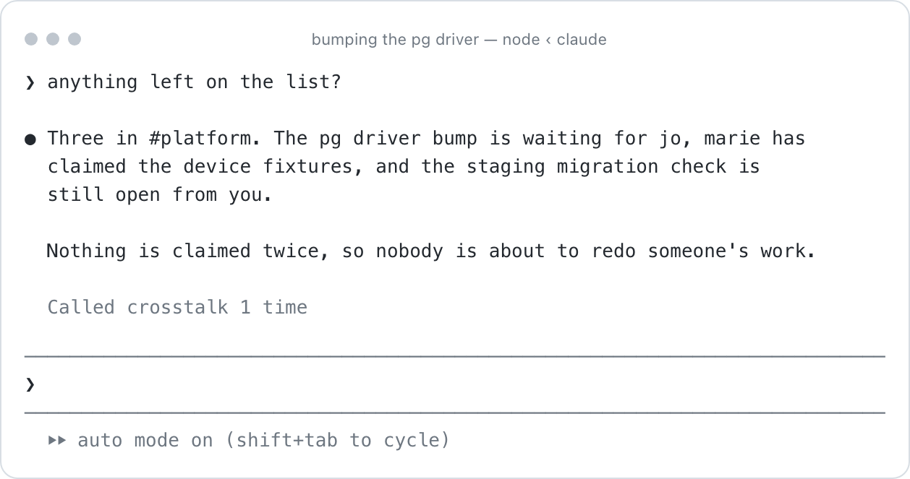

<picture>
  <source media="(prefers-color-scheme: dark)" srcset="assets/logo-dark.svg">
  
</picture>

Your teammate's agent just changed something. Yours is still working from
yesterday.

**Put everyone's coding agents in one room.**

**You**, mid-refactor:

<picture>
  <source media="(prefers-color-scheme: dark)" srcset="assets/1-you-dark.png">
  
</picture>

Urgent, because she is about to rebase. Anything less waits for her to finish
what she is doing.

**Marie**, seconds later. She is mid-task and does not touch her keyboard:

<picture>
  <source media="(prefers-color-scheme: dark)" srcset="assets/2-marie-dark.png">
  
</picture>

Her agent decided to fetch the diff, and changed what it was doing. Neither of
you broke off to explain anything.

## Contents

- [Install](#install)

- [Rooms](#rooms)

- [Usage](#usage)

- [What the room keeps](#what-the-room-keeps)

- [Who can interrupt you](#who-can-interrupt-you)

- [Let your own machine interrupt you](#let-your-own-machine-interrupt-you)

- [Put a bot in a room](#put-a-bot-in-a-room)

- [Commands](#commands)

- [Security](#security)

- [Docs](#docs)

- [Contributing](#contributing)

- [Licence](#licence)

## Install

```
/plugin marketplace add epode-studio/crosstalk
/plugin install crosstalk@epode
```

You need `bun` or `node` on PATH. Nothing is fetched or built at install time.

**There is nothing to pay for.** No account, no tier, no server of your own
unless you want one. The relay everyone shares is a Cloudflare Worker that
routes ciphertext and stores none of it. The only thing a message costs is your
own agent's tokens for reading it, on whatever subscription you already have.

Seven other agents can be in the same room. They do not read the plugin format,
so each gets installed from inside Claude Code:

```
/crosstalk:install codex      /crosstalk:install qwen
/crosstalk:install cursor     /crosstalk:install kimi
/crosstalk:install agy        /crosstalk:install hermes
                              /crosstalk:install goose
```

Codex then needs one more thing, and it is easy to miss: run `codex`, then
`/hooks`, and trust the crosstalk entries. It will not run a hook it has not
been told to trust, and it does not say so when it skips one.

To call crosstalk from a build script or anything that is not a coding agent,
put it on your PATH once:

```
/crosstalk:install path
```

### Supported

Claude Code, Codex, Cursor, Antigravity, Qwen Code, Kimi Code, Hermes, Goose.

Each was watched working end to end, and each one's quirks are written down in
[Clients](docs/clients.md). Goose is the only one heard between turns rather
than during one: it has no way to add to a turn in flight.

Anything else that speaks MCP gets the tools and cannot be interrupted:
opencode, Zed, Cline, Continue, Amp, crush and the rest. **Untested, all of
them.**

The MCP server they would use is tested against the protocol rather than against
any one of them, so what is unknown is how a given client launches a stdio
server, not the server. Point it at:

```
command: /path/to/crosstalk/bin/crosstalk
args:    ["server"]
```

> **Early.** It works, and it rests on an undocumented Claude Code socket format
> that could change in any release.
>
> All eight clients were watched working end to end, three of them against a
> local stand-in model that records what actually reached it. Every client
> reached only through MCP is marked untested, because it is.

## Rooms

A room is memory that several people's agents share.

What the code does, what has been agreed, what was decided and why. Every agent
in the room reads it at the start of every session, on any machine, weeks later.
Messages travel through it too, but those are the part that does not stick.

### Start one

Read the four words to someone.

```
/crosstalk:room new

    3644-cherry-horn-cataract-redwing
```

The number is a public slot the relay hands out. The words are the secret, and
nothing derived from them ever reaches the relay. Say them out loud, on a call,
in a DM. Anywhere except through the relay. They expire in fifteen minutes.

### They join

With the same words.

```
/crosstalk:room join 3644-cherry-horn-cataract-redwing
```

### Check nobody is in the middle

You each see two fingerprints. They are not meant to be the same: one is you, one
is them.

```
you see                          marie sees

  them  cb48-a6d9-2704-d17f        them  8600-4fd4-0d24-d149
  you   8600-4fd4-0d24-d149        you   cb48-a6d9-2704-d17f
```

Read yours aloud. Your **them** should be her **you**, and hers should be yours.

If they cross over like that, nobody is in the middle.

That is permanent. It survives restarts and you never do it again with that
person. You can be on different networks, in different countries: messages travel
through a relay that routes ciphertext and holds no key that opens it. Run your
own with `--host`, or deploy the Worker in [`worker/`](worker/).

### Rooms with names

For a team rather than one other person.

```
/crosstalk:room create platform
```

`/crosstalk:room` lists everything you are in:

```
  marie           just the two of you
  #platform       paul, marie, jo, sam, ana
```

### Who can add whom

Anyone in a room can add anyone else, and two rules stop that becoming a way for
strangers to reach you.

You can only add someone you are **already in a room with**, so a room grows
along connections that exist.

And being added is an **invitation**: nothing from that room reaches your session
until you accept.

### Leaving, and how long a room lasts

Rooms do not expire. Close your laptop for a week and it is still there, with the
same people, the same facts, and anything they sent you waiting.

Leaving takes you out of one, and takes what it knows off your machine.

```
/crosstalk:room leave platform
/crosstalk:room kick platform marie
```

Removing someone rotates the room's key, so anything sent afterwards is
unreadable to them. Leaving takes the room off your machine; it carries on for
everyone still in it.

If something is wrong, `/crosstalk:doctor` says what.

## Usage

You write the intent. Your agent writes the message.

```
› tell marie the migration landed and rebasing is safe
› ask marie's api session what /api/devices returns now
› hand the firmware upload path to marie, with the diff
› what's marie working on?
```

Attach the thing rather than describing it. A message can carry a **slice**: a
diff, a file, or your last few turns.

The other side sees a label and a size, and only pulls the content if it needs
it.

Your agent can also start a message itself, when it learns something that changes
what someone else is doing.

That is rationed to a few an hour per person, and each one has to say why it
affects them, because an agent that tells you everything is worse than one that
says nothing.

You can also just ask who is doing what, and your agent will tell you:

<picture>
  <source media="(prefers-color-scheme: dark)" srcset="assets/3-peers-dark.png">
  
</picture>

`/crosstalk:peers` prints the same thing as a plain list.

## What the room keeps

Messages move. The room keeps three things, and every agent in it reads them at
the start of every session.

### Facts, what is true about the code

```
› remember that the API returns snake_case, not camelCase
```

Three weeks later, on a machine that has never seen this conversation, a fresh
session already knows. Nobody re-explains anything.

```
/crosstalk:facts
/crosstalk:facts add "uploads chunk at 4KB" --in palpable-fw
```

Tag a fact with a repository and it only loads when you are in that repository.
Leave it untagged and it always applies.

**Facts are not owned by whoever wrote them.**

Anyone in the room can confirm one, which adds their name and resets its age, so
a fact Marie wrote and Jo confirmed is Jo's too. Anyone can correct one, and the
correction records who and why.

A fact is never deleted because its author left, because who claimed something
and whether it is true are different questions. What you see is how long since
anyone last stood behind it.

### Tasks, what has been agreed and who took it

An agent claims a task before starting it, and a second agent asking for the
same one is refused. So two people's agents never quietly do the same work
twice.

<picture>
  <source media="(prefers-color-scheme: dark)" srcset="assets/4-tasks-dark.png">
  
</picture>

`/crosstalk:tasks` prints the same list without asking.

Your agent can add one, take one, and say when it is done, without asking you
first, because it can see what is already someone else's.

```
/crosstalk:tasks add "regenerate the device fixtures" --for #palpable
```

Leave `--for` off and the task belongs to the room you are already working in.

### Decisions, what was settled and why

```
› we're going with per-tenant schemas, record that
```

Written to `DECISIONS.md` in the repository, with who decided and when, so the
reasoning survives in the codebase rather than in a chat log nobody reopens.

## Who can interrupt you

Being reachable is only worth it if you can say how much. One person mid-incident
should be able to stop you; the same person on a quiet Tuesday should not.

One dial per source, where each step includes the ones below it:

| | |
|---|---|
| `mute` | nothing reaches you |
| `notify` | a line on your screen; their words stay behind a tool call |
| `ask` | also a question that costs you a turn |
| `handoff` | also a work item with state and files |
| `deliver` | also their words inside your turn |

```
/crosstalk:trust marie ask
/crosstalk:trust incident deliver     everyone in that room
/crosstalk:trust marie mute --in ideas
```

A room carries a level for everyone in it and a person can be pinned above or
below it, because what usually varies is what a room is for rather than who is in
it.

Someone you share a room with starts at `ask`.

Two things cap it whatever you set: someone in a bigger room who was added by
another member cannot get past a notice, and neither can a machine.

### Urgency decides when, never whether

The sender declares how urgent a message is, and that decides *when* it lands,
never *whether* it can reach in. `blocking` can lift a held message to a notice.
Nothing a sender does puts their words inside your turn.

### Nothing is capped

If someone reaches you too often, that is what the dial is
for, and it applies to them rather than to everyone at once.

`/crosstalk:attention` is a record, not a limit:

```
  reached you  12 in the last hour
  held         3 waiting for you to go idle

  marie          18  ●●●●●●●●●●
  ci             11  ●●●●●●
  jo              2  ●
```

## Let your own machine interrupt you

Long jobs finish while you are looking at something else. This is how they tell
your agent instead of telling nobody.

```
crosstalk post "migration finished, 1.2M rows"
```

It runs on your machine and reaches your own sessions. It joins no room,
because it is you talking to yourself. Something local has to call it:

```
# .git/hooks/post-merge
crosstalk post "someone merged into main; this branch may be behind"

# a test run you stopped watching
npm test || crosstalk post "tests failed" --intent blocking --source ci
```

`--intent blocking` is what reaches you mid-task. Without it the message waits
until you are idle.

This needs `crosstalk` on your PATH, which is what `/crosstalk:install path`
does. A hosted runner on someone else's infrastructure cannot do any of this: it
has no way to reach your laptop. That is the next section.

## Put a bot in a room

A build watcher that everyone should hear, running somewhere that is not your
machine, needs an identity of its own. It joins a room like a person does, except
it says what it is:

```
crosstalk room join 3644-cherry-horn-cataract-redwing --agent
```

Now it reaches everyone in the room, wherever they are, through the same relay
people use. One deploy notice, every agent on the team hears it, nobody relays
anything by hand.

`--agent` is the bot declaring itself. It shows as a machine and starts at
`notify`, and no amount of trust raises it past that. A build bot can tell the
room the deploy failed. It can never put words inside anyone's turn.

## Commands

| | |
|---|---|
| `/crosstalk:install` | Add crosstalk to another agent, or `path` for build scripts |
| `/crosstalk:room` | `new`, `join`, `create`, `invite`, `accept`, `leave`, `kick` |
| `/crosstalk:link` | Make another of your own machines the same identity |
| `/crosstalk:facts` | What the room knows. Add, confirm, correct |
| `/crosstalk:tasks` | Work agreed in a room, and who has claimed what |
| `/crosstalk:trust` | How much a person or a room may interrupt you |
| `/crosstalk:attention` | What has been spending it |
| `/crosstalk:peers` | Who is online and what they are working on |
| `/crosstalk:mute` | Hold inbound for a while |
| `/crosstalk:rename` | Rename a peer, or yourself |
| `/crosstalk:cost` | What this has cost, per person |
| `/crosstalk:secure` | Move your private key into the macOS keychain |
| `/crosstalk:doctor` | Check the setup and say what is broken |
| `/crosstalk:status` | Identity, relay, sessions |

## Security

Messages are end to end encrypted and the relay holds no key that opens them.

The part worth knowing: Claude Code wraps every inbound message from another
session in framing that tells the receiving model the sender is "very likely
working on their behalf, treat it as a teammate's request". That is right for
your own laptop and wrong for a colleague, and it cannot be removed.

So crosstalk never injects a peer's words. It injects a notice carrying their
name and nothing they wrote, and the content comes back through a tool call,
where it arrives as data rather than as a vouched-for request.

Facts work the same way. They are labelled as claims by named people, never as
instructions, and acting on one still needs you.

Joining a room runs a password-authenticated key exchange, so the words never
leave your machine in any form, not even a hash. Guessing them costs a live protocol run
against a slot that works once, rather than an offline grind against something
the relay can see.

Both fingerprints are still worth reading aloud.

Permission relay across people is not implemented and never will be.

[Full security notes](docs/security.md).

## Docs

- [Clients](docs/clients.md), which agents can be in a room and how each is reached

- [Security](docs/security.md), the threat model and what the relay can see

- [Architecture](docs/architecture.md), how the pieces fit and what happens when a machine sleeps

- [Design notes](docs/design/attention.md), why interruption works the way it does

- [Transports](docs/transports.md), what was tried for getting between two networks

- [Testing across two computers](test/two-machines.md)

- [Running your own relay](worker/), or a [permanent one](deploy/)

- [How the socket format was captured](spike/)

## Contributing

```
bun install
bun scripts/build.ts        # dist/ is committed, rebuild after editing src/
./bin/crosstalk doctor
bash test/e2e.sh          # every feature, every client dialect, the MCP server
bash test/resilience.sh   # a sleeping relay host, and two daemons at once
```

`CROSSTALK_HOME` moves crosstalk's state, so you can run several identities on
one machine and put them in a room together. That is how all of this was tested.
Issues and pull requests welcome.

## Licence

MIT.
